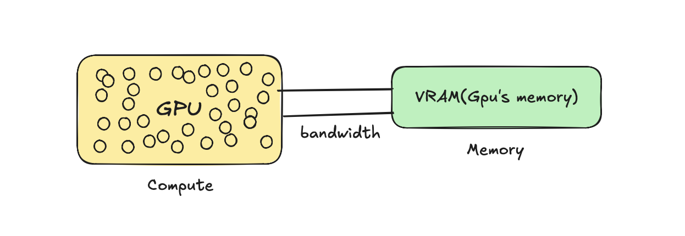
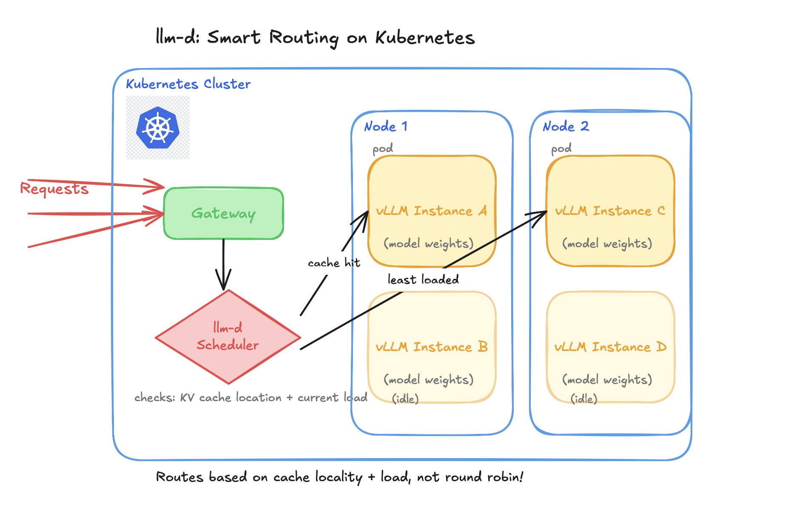

+++
title = "LLM Inference at Scale: vLLM and llm-d"
date = 2026-08-26
draft = false
show_reading_time = true
omit_header_text = true
toc = true
description = "Understanding vLLM and llm-d for serving LLMs inference at scale on Kubernetes"
tags = ["vllm", "llm-d", "kubernetes", "inference"]
images = ["llm-d-kubernetes-routing.png"]
+++

Running AI infrastructure breaks a lot of the traditional ways we're used to dealing with systems. In this blog, I write about how you can serve AI models efficiently for inference on Kubernetes on hardware like GPUs (which are super expensive!!!), and how vLLM can help you manage memory efficiently while llm-d can help load balance the system smartly to your needs.
<!--more-->


I put this together to explain things in a layman way, cause most AI terms sound scary when you hear them thrown around (atleast for me :)), but once I actually tried to understand them, I realized it's just the words that sound heavy. So before I get into the actual problem, let me walk you through how I built up to understanding it, piece by piece.

## What is AI Inference ? 
Let's start right at the beginning, with the word that's literally in the title: inference.

AI inference is basically using a trained model to "infer" (predict) the answer based on the data its been trained on. Example: you ask model "The capital of Canada is", when it answer to you "Ottawa" it basically inferring that information back to you that it saw in its pre-training phase.

## What are Model and its weights ?
So what actually is a model doing when it "infers" something?

A model is a formula with weights(numbers) baked in. Most models share a common architecture: that is transformer architecture which is like the recipe, and weight is the learned parameters plugged into it. 

Weights are what make models **unique**, ex: claude has different weights, gpt has different ones, even on the same architecture. They start out as basically random numbers, but with pretraining they get better and better as the model sees more data.

Example : to predict the house price:

You start with random weight(number) lets say : 0.3
- Now in starting when you feed to predict price of 1000 sq ft house that actually sold for $300,000.
you get _Price = weight x size = 0.3 x 1000 = $300_ which is so wrong compared to  $300,000.

- Repeat this across millions of house examples (different sizes, different real prices), each time, the weight gets pushed slightly closer to whatever value actually predicts well

Now a real LLM isn't one formula with one weight, it's billions of formulas and weights, across many layers. So it means soo many calculations happening!!

## Who Runs These Calculations: CPU or GPU?

So if there's billions of calculations happening every time you send a model a prompt, the obvious next question I had was: what's actually crunching all these numbers?

CPU ?? Nahhh cpu is made up of few powerfullll cores (which is useful if you have very complex tasks) and and it can only do a handful of things at once, which is not good in our case , why 
1. we do not need very powerful core since these calculations are really simple multiplications
2. These cores are few, but our calculatiosns are in billions and since it can do only a few calculations at a time so latency go higherr :(


Here comes GPU : 
GPU has so manyyy simple cores which can perform task parallely , which is what we need to perform so many simple calculations faster!!!

For GPU to perform calculations , it need to store the numbers somewhere , so that memory is called VRAM, and then speed at which data flow is called memory bandwidth. 



Okay, so now I know billions of calculations happen, and GPUs are built to handle that. But here's the thing: those calculations aren't all the same kind of work. There are two very different phases happening every single time you send a prompt.

## How inference works: Prefill + Decode 
There are basically 2 phases :

1. **Prefill**: The phase where the model tries to understand the prompt you gave it.
In this phase, the GPU reads the weights from memory in one forward pass (it needs those weights to do the calculations!!!). Since this one step involves so many calculations happening across so many tokens at once, this is a **compute-heavy** phase.

2. **Decode**: The phase where model generates the next token _at a time_. 
	- First it reads the weight from the memory (it need those weights to understand and generate) and then produces new token , 
	- Then reads again the weight and the prompt with last token it generated in next step, do calculations and produce next token.

Since most of the time depends on how fast the weights reach the GPU, this is a very memory-bandwidth heavy phase , in one step the GPU only has to produce one token, so there's very little compute happening, and most of it stays idle.

Also generating each new token means the GPU has to go back and read through the prompt again just to produce ONE more word. Thats so wasteful to me but there a fix!!!

## KV Caching ?
Without caching, every decode step basically redoes prefill from scratch, re-processing the entire prompt plus everything generated so far, just to produce one new token. For a response of N tokens, you're redoing almost the same work N times!!! Total waste of GPU that already did this understanding for you.

To fix this, we save that work (the "understanding" of every earlier token) in memory (VRAM) instead of throwing it away each step. Now the model just checks the cache and computes only the new part, instead of reprocessing everything. That saved work is the KV cache.

Okay, so at this point I finally had a decent understanding of what happens inside a single request. Prefill understands the prompt, decode generates tokens one by one, and KV cache saves us from redoing work. Cool! So I figured, let me just wrap this thing in an API and ship it... and that's exactly where I came across all these cool thingss :)

## The Problem with Traditional APIs: A Very Idle, Very Expensive GPU :(

Now you actually need to write this out. You'd use PyTorch (an ML Python framework) to load the model and then run the script:
```
## simple script how it would look like 
import torch
from transformers import AutoModelForCausalLM 
model = AutoModelForCausalLM.from_pretrained(Qwen/Qwen2.5-0.5B)
inputs = tokenizer("The capital of Canada is")
outputs = model.generate(**inputs) ## Ottawa (this is called inference)

```

Now this script is just for you to test but in real production you will receive so many users and they need to access this model and make requests , 
so you need to expose as endpoint. 

Normally when you have a traditional python app and you want to expose, you might just wrap like FastAPI, but it does not work in this case :

1. It cannot handle multiple requests : I know FastAPI is **asynchronous** but internally in logic we are using `model.generate()`  which in itself is a _synchronous_ operation, so when request-1 comes in, it completes that full request before processing another . 

**Why thats even worse than not being able to handle concurrent users?** 
Because inference tasks need GPUs, and you know those are super expensive. So imagine when there's just one request being processed at a time, most of the GPU sits idle, and you're wasting money for nothing!!!

So here we have a better solution for it : vLLM 

## vLLM : Serving model efficiently

vLLM is a serving engine which help to serve the model **efficiently** on hardware like GPUs to many users concurrently over API. 
It does so by PagedAttention(manage KV cache) and Continuous Batching . 

### PagedAttention: The Memory Bottleneck
Most of the time, serving an LLM is bottlenecked by one issue: **MEMORY**.
Remember the KV cache from decode, that's basically memory for a request, stored in VRAM. If you have n number of user requests, you have n number of KV caches sitting in memory. Once that memory runs out, you can't serve more requests, even if the GPU still has idle compute sitting around!!! __This is actually why a lot of people think they need more compute and buy an expensive GPU, when the real issue was memory the whole time.__

This is exactly what PagedAttention solves. Normally, systems pre-reserve one big contiguous block of memory per request upfront, even if that request never ends up using all of it, so a chunk just sits there wasted.
PagedAttention does it differently: instead of pre-reserving memory upfront, it allocates small, non-contiguous blocks on demand as the cache actually grows. No wasted reservations, way more requests fit in the same VRAM.


### Continuous batching : Multiple requests 

In decode, the GPU can only produce one token per request per step, which wastes a ton of GPU since it's mostly idle anyway. So instead of processing requests one at a time, we group multiple requests together and generate their next token in the same step. That's batching.

Continuous just means requests don't wait for a fixed batch to finish, as soon as one finishes, a new one jumps in right away. So the batch keeps changing every step instead of everyone waiting around.


## llm-d : Why normal Load Balancing breaks ?

Now we have a vLLM server, but based on our use case we might need multiple instances of it, and now we need something to load balance requests across those instances. We cannot use a normal LB here since it just does round robin, why?
1. KV cache is stored per server, so if the next request doesn't land on the same server, you lose that cache and the GPU has to recompute again!!!
2. Not every request is equal, one might be a simple one liner while another is summarizing a 100 page doc, but a normal LB treats them the exact same way.

So we need a **smart scheduler**. That's what llm-d is: a system that helps route inference requests intelligently across vLLM instances based on each instance's state (like KV cache and load), in a distributed system. and llm-d sits right on top of Kubernetes


## Deploy : Kubernetes



Kubernetes is the container orchestration platform, so all these vLLM instances we created, we don't want to manage them manually. We need something to restart the pods if they crash, and scale them up or down based on demand.

Each vLLM instance runs inside a pod, pods run on nodes, and Kubernetes handles all the stuff: making sure a pod actually has a GPU available before scheduling it there, restarting a pod if it crashes, and spinning up more vLLM instances automatically if traffic spikes (or scaling down).


_If you read till the end , thank you so much, I hope this can help you to understand and explore more on these topics, byeee!!!_


