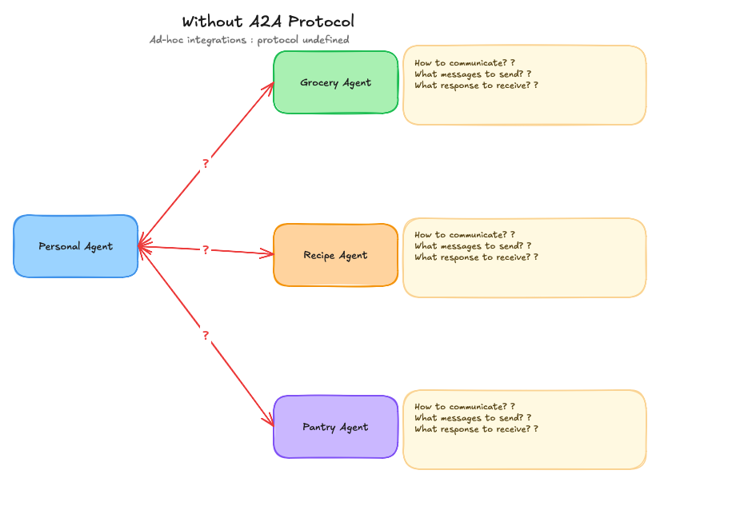
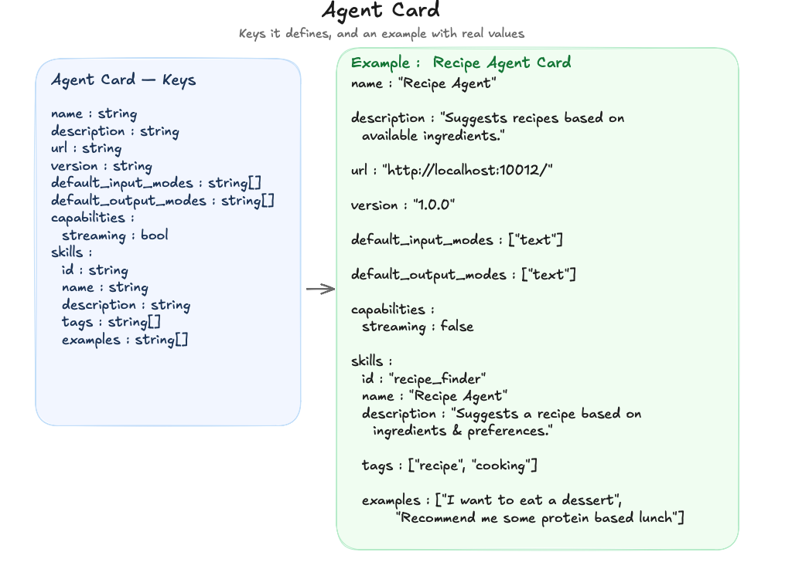
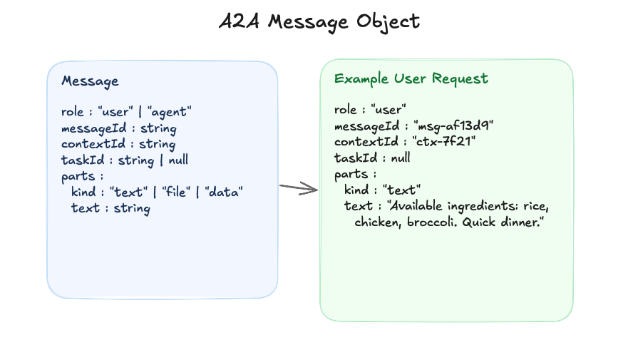
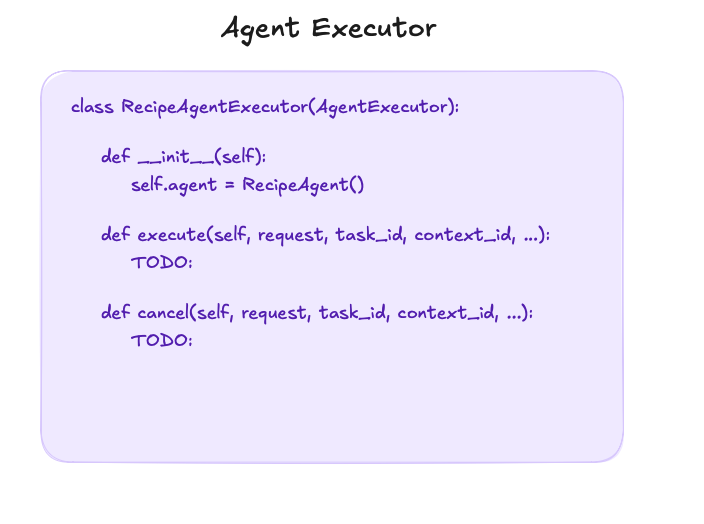
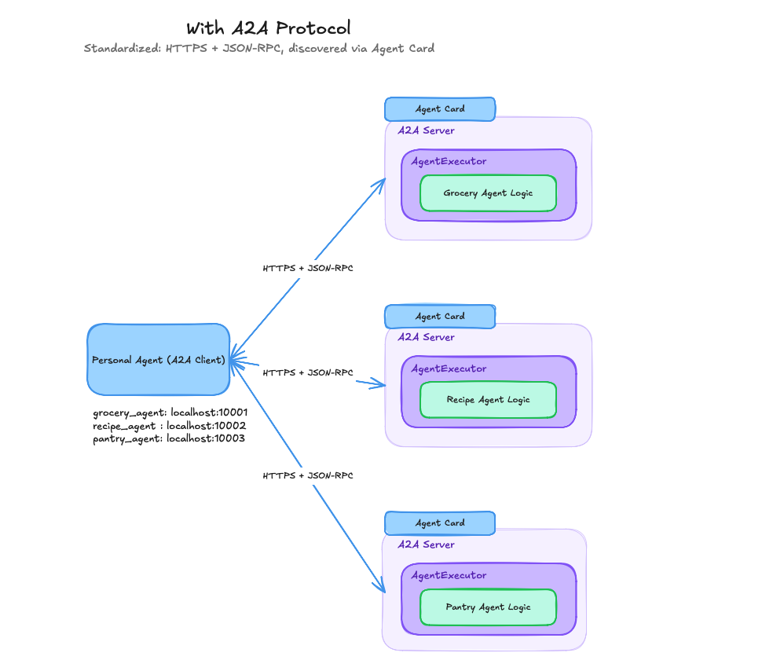
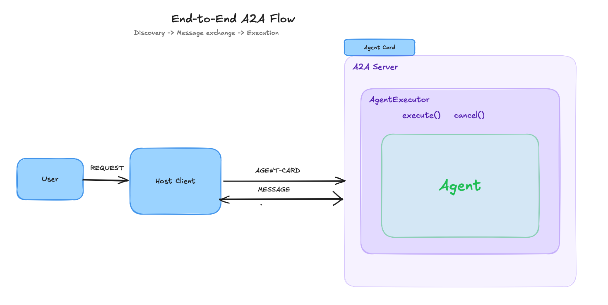

+++
title = "A2A (Agent-to-Agent) Protocol"
date = 2026-09-11
draft = false
show_reading_time = true
omit_header_text = true
toc = true
description = "Understanding the A2A (Agent-to-Agent) Protocol"
tags = ["a2a", "protocol", "agents"]
images = ["a2a-protocol.png"]
+++


Thisblog is about A2A (Agent2Agent) protocol: why it exists, how it actually works under the hood and a full walkthrough of building your own multi-agent system by leveraging other people's agents. I'll be using a recipe-finder multi-agent example the whole way through, and you can grab the full code here: [repo link].

<!--more-->

Let's get into it.

## Why do we even need A2A?

You've probably been here before: you found a cool agent someone else built, maybe a friend's project, maybe some random GitHub repo, and you want to plug it into your own system. And it's just... annoying. They used a different framework, their code makes assumptions yours doesn't and now integrating means going in and hacking things together just to get the two talking.

Now scale that up. Say you want to build a system that leverages a *bunch* of other people's agents. For every single one, you're stuck answering the same three questions from scratch: what does this agent actually do, how do I send it something, and how do I get a response back? Multiply that by however many agents you're plugging in, and you've written a pile of custom glue code before you've done anything actually useful.

That's the exact problem A2A solves. It **standardizes** how agents talk to each other, so you can plug into someone else's work without caring what framework they used or how their internals are wired.

I know "standardization" sounds a little abstract, so let's actually get into what that means.



Note : You can see here how our agent want to talk to these 3 agents but unable to talk to them because you don't know what they do , how to send them a message and how to get a response back.

## How A2A actually standardizes things ?

Now A2A solves all of these questions by standardizing three things: discovery, message format, and execution. Let's go through each one.

Say your personal agent needs to talk to a couple of outside agents your friend built, a `grocery_agent` and a `recipe_agent`. What you do is expose each of these as its own little server: `grocery_agent` on `localhost:10001`, `recipe_agent` on `localhost:10003`. Now your agent at least has an address to find them at.

Cool, so now you can connect. But connect to *what*, exactly? What does this thing even do? That's the next problem, and it's what the Agent Card solves.

### Agent Card

Here's the idea: A2A doesn't touch how you build your agent internally, do whatever you want in there. But what you add is code for describing the metadata : name, description, what skills it has, what it can actually do. So when your personal agent wants to talk to the recipe agent, it just make  a `GET` request, to figure out what it's dealing with and what it can actually do. This is the Agent Card, a JSON object that every agent publishes about itself.


*An Agent Card: the metadata every agent publishes about itself.*

Okay, so now your agent knows what it's talking to. Next problem: how does it actually send it something?

## How to send the message

This is the other half of the standardization. A2A defines one JSON schema for messages, and everyone, no matter whose agent it is, sends and receives in that exact same shape.



## Agent Executor

Now here's where it gets interesting. Once the message actually lands, who picks it up? Who calls the low-level function where the agent gets invoked? Your friend might've named theirs `start()`, someone else went with `invoke()`, someone else `run()`. Left unstandardized, you're back to writing custom code per agent just to trigger it.

So A2A wraps the agent in an **AgentExecutor**. Whatever your agent's real function is called on the inside, the executor exposes exactly two things to the outside world: `execute()` and `cancel()`. Every request goes through that same two-function surface, and internally, `execute()` is what actually calls into your agent's real logic.


*AgentExecutor wraps the agent: outside, it's just `execute()` and `cancel()`.*



## Putting it all together: the end-to-end flow

So here's the whole flow, 

1. the user sends a request
2. the Host Client picks it up
    -  fetches the Agent Card to figure out what it's dealing with
    -  decides to call the agent
    -  sends it a Message
3. the AgentExecutor's `execute()` picks that up
    - calls into the actual agent, 
    - and the response flows all the way back.


*The full flow: discovery, then message exchange, then execution.*

## Building a multi-agent example

Alright, code time. This is the [GitHub repo link](https://github.com/KashishV999/code-demos/tree/main/A2A-protocol) 

Here's what we're building: a system where you ask your personal agent to suggest a recipe. It checks your pantry for what's available, suggests a recipe based on that and tells you what else you'd need to buy. So your personal agent needs to talk to 3 external agents:

1. **Pantry agent**: looks up what's available in your pantry
2. **Recipe agent**: suggests the recipe
3. **Grocery agent**: figures out what you still need to buy

None of these were built with "please integrate with my system" in mind, they're just standalone agents. So here's how we can wired them up.

**First, expose each agent on its own local port**, so my agent has somewhere to find it:

```python
if __name__ == "__main__":
    uvicorn.run(app, host="localhost", port=10011)
```

**Then, give it an Agent Card**, so it's actually discoverable. Here's the one for the pantry agent:

```python
skill = AgentSkill(
    id="pantry_check",
    name="Pantry Agent",
    description="Looks up what ingredients are currently available in the pantry.",
    tags=["pantry", "inventory"],
    examples=["What ingredients do I have available?"],
)

agent_card = AgentCard(
    name="Pantry Agent",
    description="Checks the pantry for available ingredients.",
    url="http://localhost:10011/",
    version="1.0.0",
    default_input_modes=["text"],
    default_output_modes=["text"],
    capabilities=AgentCapabilities(streaming=False),
    skills=[skill],
)
```

**Next, wrap it in an AgentExecutor**, so no matter how the pantry agent's internals are written, I only ever have to call `execute()` and `cancel()` on it:

```python
class PantryAgentExecutor(AgentExecutor):
    def __init__(self):
        self.agent = PantryAgent()

    def execute(self, request, task_id, context_id, ...):
        # calls self.agent's real invoke logic
        ...

    def cancel(self, request, task_id, context_id, ...):
        ...
```

**Finally, on my side, the Host Client resolves the card and sends the message:**

```python
async with httpx.AsyncClient() as httpx_client:
    resolver = A2ACardResolver(httpx_client, base_url="http://localhost:10011") // gets the agent card from the pantry agent
    card = await resolver.get_agent_card()

    factory = ClientFactory(ClientConfig(httpx_client=httpx_client))
    client = factory.create(card) // creates a client that knows how to talk to the pantry agent

    message = Message(
        message_id=str(uuid.uuid4()),
        role="user",
        parts=[Part(root=TextPart(text="What ingredients do I have available?"))],
    )

    async for event in client.send_message(message): // sends the message to the pantry agent and streams back the response
        ...
```

Card, executor, then Host Client makes the connection and sends the request. Same exact pattern for Recipe and Grocery, just swap the port and the message, nothing else changes.

That's honestly the whole magic trick. I never had to open my friend's code and figure out how their agents work internally. I just needed their Agent Card and a standard way to send a message, and A2A took care of the rest.